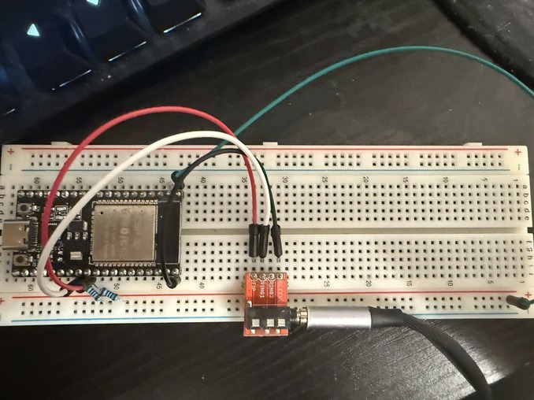
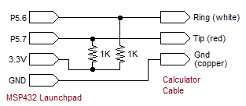

# Spo(TI)fy
Spotify on the TI-84 Plus

### TODO: Make better description

## Setup:

### For the assembly version:
1. #### Download SPASM and add it to the project
2. #### Open the terminal and paste ``` ./spasm64.exe src/z80/main.asm exec/SPOTIASM.8xp```
> #### Note that the assembly version is not yet in a working state and is currently being worked on
### For the TI-BASIC version:
1. #### Open the `SPOTIFY.8xp` file in ```src/TI-BASIC``` either
- Any JetBrains IDE
- Visual Studio Code

2. #### Build the program in one of the following ways: 
- #### JetBrains IDE  
1. Download the TI-BASIC plugin from the plugin marketplace in any JetBrains IDE
2. Right-click on the file and select `Associate with File Type` and select `TI-Basic source file`
3. Add a new configuration, add the open file into the input path, and set the output path to ``exec/SPOTIFY.8xp``
4. Name the configuration Spo(TI)fy and the output name to SPOTIFY
- #### Visual Studio Code
1. Download the TI-BASIC plugin from the plugin marketplace or directly download the .vsix directly from their [repository](https://github.com/TIny-Hacker/language-ti-basic/releases/tag/v1.0.3)
2. Press ``Ctrl + Shift + P`` and search for `Export TI-BASIC Program`
3. Save it to `exec/`
> Create the directory if needed
### For the ESP32:
1. #### Download the Platform IO plugin on either
- Any JetBrains IDE 
> You may need to install [Platform IO core](https://docs.platformio.org/en/latest/core/installation/methods/installer-script.html)
- Visual Studio Code
2. #### Open the `platformio.ini` file and wait till it finish setting up the project
3. #### Connect your ESP32 and upload the program
> Different microcontroller support will likely be added in the future
### For the Python script
1. #### Make sure you have python installed
2. #### Login to your [Spotify dashboard](https://developer.spotify.com/dashboard) and make an app
3. #### Take the client ID and Secret and put them in the `CONFIG` file
4. #### Add `http://127.0.0.1:8888/callback` to your Redirect URLs
5. #### Add your ESP32's COM port in the `CONFIG` file
### Putting it all together
1. #### Upload the `exec/SPOTIFY.8xp` file to a TI-84 Plus
2. #### Create a simple breadboard follwing this design 


> Make sure the TIP pin is set to pin 17 and RING pin set to pin 16
3. #### Upload the code to the ESP32
4. #### Start the Python program while listening to music
5. #### Connect the link cable to the calculator and ESP32
6. #### Start the program on the calculator
## Basic Input
- #### 5 to Pause/Resume
- #### 4 to Replay the previous song
- #### 6 to skip current song
> #### Note you will need to mash the buttons using the TI-BASIC version due to the input delay
