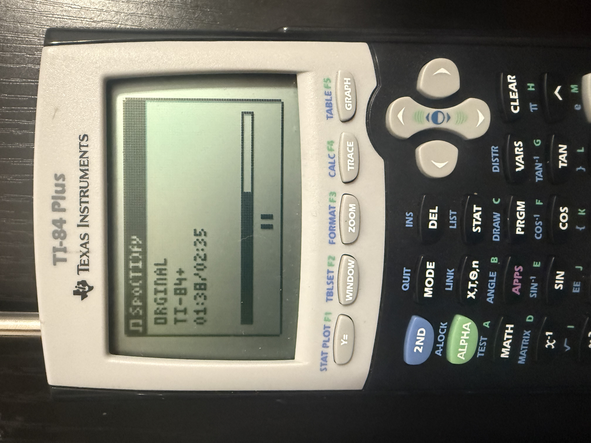
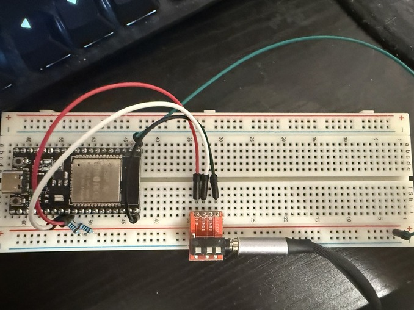
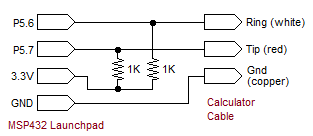

# Spo(TI)fy
### Spotify on the TI-84 Plus

### TODO: Make better description
 [Upcoming features here](https://trello.com/invite/b/6a775f8947624efff6cf8bc8/ATTI86d66a644fbd39037e9389fa5b3325f64B462CF3/spotify)

## Setup:

### For the Calculator Program:
1.  Download [SPASM](https://github.com/alberthdev/spasm-ng/releases/tag/v0.5-beta.3) and add it to the `src/z80` folder
> If you don't know which one to choose, Just choose the Windows 64-bit version 
2.  Create the `exec` directory in the root of the project
2.  Open the terminal and paste `cd src/z80` and `./spasm64.exe main.asm ../../exec/SPOTIFY.8xp`

### For the ESP32:
1.  Download the Platform IO plugin on either
- Any JetBrains IDE 
> You may need to install [Platform IO core](https://docs.platformio.org/en/latest/core/installation/methods/installer-script.html)
- Visual Studio Code
2.  Open the `platformio.ini` file and wait till it finish setting up the project
3.  Connect your ESP32 and upload the program
> Different microcontroller support will likely be added in the future
### For the Python script 
1.  Make sure you have python installed
2.  Login to your [Spotify dashboard](https://developer.spotify.com/dashboard) and make an app
3.  Take the client ID and Secret and put them in the `exCONFIG` file and rename it to `CONFIG`
4.  Add `http://127.0.0.1:8888/callback` to your Redirect URLs
5.  Add your ESP32's COM port in the `CONFIG` file
### Putting it all together
1.  Upload the `exec/SPOTIFY.8xp` file to a TI-84 Plus
2.  Create a simple breadboard follwing this design 

> Make sure the TIP pin is set to pin 17 and RING pin set to pin 16
3.  Upload the code to the ESP32
4.  Start the Python program while listening to music
5.  Connect the link cable to the calculator and ESP32
6.  Start the program on the calculator
## Basic Input
- `Clear/On` to exit the program
-  `5` to Pause/Resume
-  `4` to Replay the previous song
-  `6` to skip current song
>  Note that you will need to hold down the keys since there is some input delay naturally (its running on a calculator have mercy)
